# mediawiki的简单使用

## logo替换

您可以进入share_data目录，使用160x160大小的图片文件替换logo
如图所示
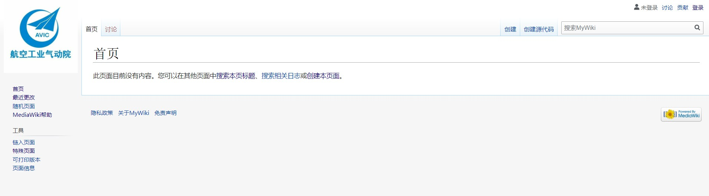

## 系统登陆

如上图从右上角进行登陆，第一次登陆可能会重置密码，您可以按照

### 系统基础功能点向导

#### 1. 创建词条

您可以使用右上角的搜索框搜索任意词汇，在搜索结果页面，您可以直接选择创建一个词条，以此来新建词条, 如下所示点击流体力学即可创建流体力学词条
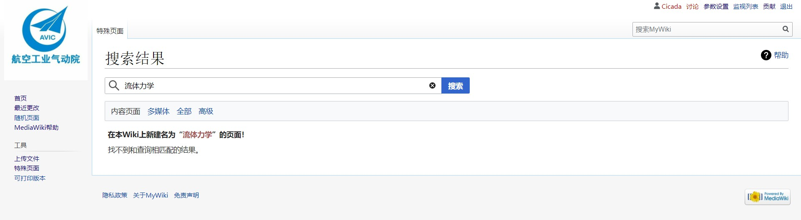

#### 2. 特殊页面功能点

左边导航栏可以进入特殊页面，wiki管理基本上都基于这个页面进行处理，您可以通过向导进行探索，我们将后续持续的更新相关的中文文档，以供用户查阅

##### 1.创建用户

您可以在用户这一大栏目中找到用户创建，并且能分配基础的一些权限, 如下所示


##### 2. 词条管理

您可以对最近的修改进行查看，和回滚，您还可以对部分词条进行一个监视，包括最近wiki上传的文件，您也可以管理起来
基本上都基于最近修改和日志这一大栏
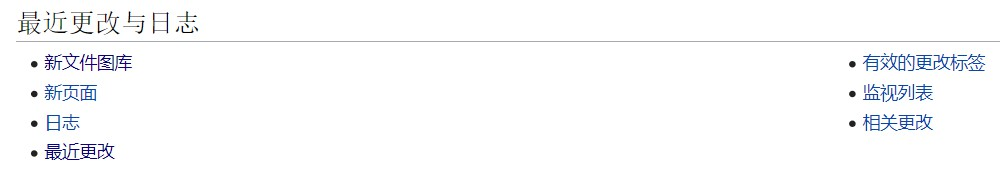

##### 3. 用户分数贡献

您可以在数据与工具这一栏中找到贡献分数，查看某些时间段内用户修改及其得分的情况
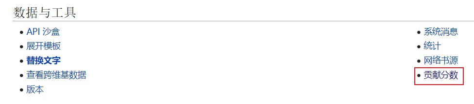


##### 4. 用户权限功能

您可以在用户和权限当中根据向导配置权限和权限相关方案，我们后续会提供更详细的文档，和更细致的权限划分
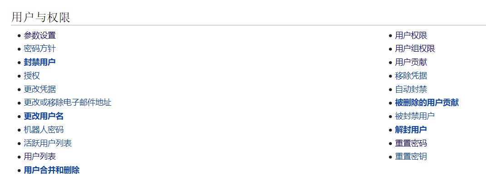

##### 5. 上传文件及其相关

您可以在媒体文件报告和上传中，上传文件，查看上传列表，以及管理上传文件的版本，具体入口如下图所示


###### 5.1 上传文件

您可以上传图片中类型的文件，其中pdf和视频以及图片格式的文件均可以按照某些方式在网页中展示，office相关文件，目前只能做为在网页中嵌入，作为可下载文件存在于wiki当中。
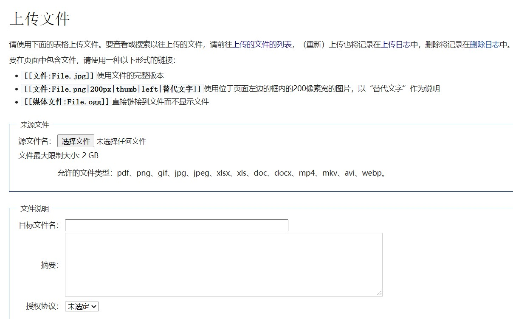

## 可视化编辑器

Mediawiki默认状态下是没有首页的，您可以在第一次进入系统后创建一个首页，选择创建本页面，即可开始创建首页，您可以使用源代码模式和可视化编辑器的模式对wiki进行编辑，
如下所示
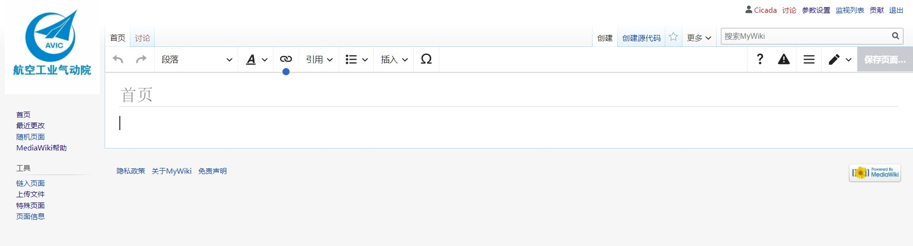
以下是可视化编辑器的工具栏

分别是向前撤销、向后撤销、用于排版的段落标题、字体调整、wiki内链联想引用、列表及缩进、插入富文本（图片、视频、表格、公式等）、特殊符号

### 可视化编辑器功能点

#### 1. 公式插入

您可以在可视化编辑器中的数学公式中找到您需要的公式基础，您也可以选择直接编写Latex文档来进行公司的输入，完成输入的公式将会展现在词条当中,如下所示
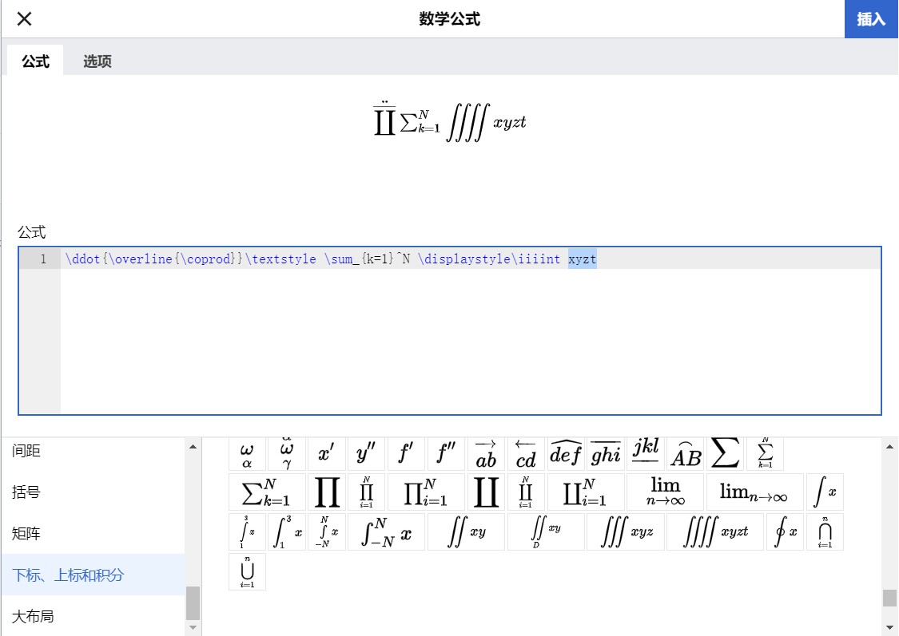

#### 2. 图片插入

您可以直接在插入中找到媒体文件，并在其中选择图片文件上传到wiki，wiki将直接展示图片在词条页面中

#### 3. 视频插入

1. 您可以在插入文件中直接上传媒体文件，或者选择在左边导航栏中上传文件
2. 使用源代码编辑器，插入以下代码来插入视频，其中videoUrl您需要在上传列表中，点击视频播放后，复制浏览器地址栏中的地址对下述videoUrl进行替换

```
{{#widget:Html5media
|url={videoUrl}
|width=640
|height=360
}}
```

如地址为
```
http://localhost:8080/images/0/0d/2020-09-24_15-53-01.mkv
```
则目标代码为，width和height是视频窗口的宽度和长度，您可以按需要配置
```
{{#widget:Html5media
|url=http://localhost:8080/images/0/0d/2020-09-24_15-53-01.mkv
|width=640
|height=360
}}
```
上传列表界面展示如下
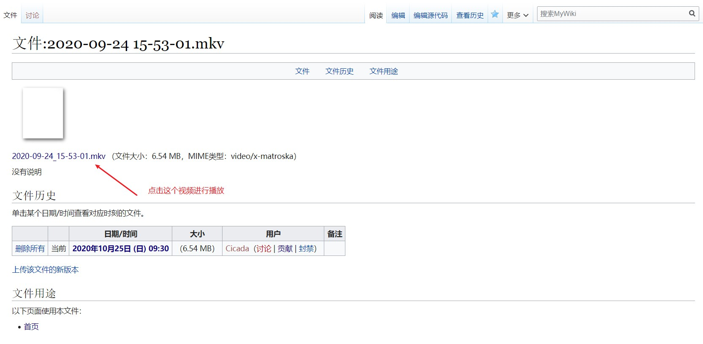

预览的时候报如下的错误的话实际上是因为没有小组件模版
```
小工具Html5media出错: Unable to load template 'wiki:Html5media'
```
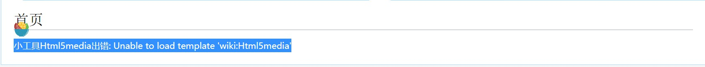
您可以点击`小工具Html5media`,拷贝入以下代码，然后保存页面，重新加载页面即可
```
<noinclude>__NOTOC__
This widget allows you to embed '''[https://github.com/etianen/html5media HTML5 Video Media]''' on your wiki page.

Created by [https://www.mediawikiwidgets.org/User:Taipan taipan]

== Using this widget ==
For information on how to use this widget, see [https://www.mediawikiwidgets.org/Html5media widget description page on MediaWikiWidgets.org].

== Copy to your site ==
To use this widget on your site, just install [https://www.mediawiki.org/wiki/Extension:Widgets MediaWiki Widgets extension] and copy the [{{fullurl:{{FULLPAGENAME}}|action=edit}} full source code] of this page to your wiki as page '''{{FULLPAGENAME}}'''.
</noinclude><includeonly><script src="//resources/src/html5media.min.js"></script><video src="<!--{$url|validate:url}-->" width="<!--{$width|default:425|validate:int|escape:'html'}-->" height="<!--{$height|default:355|validate:int|escape:'html'}-->"
controls preload></video></includeonly>
```
成功后如下所示
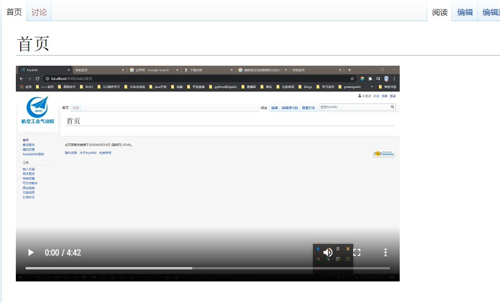

#### 插入pdf

首先需要上传您要展示的pdf，如`图解HTTP.pdf`
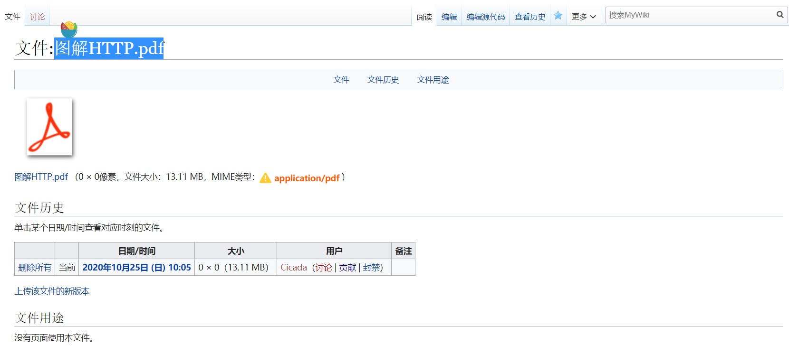

打开源代码编辑器, 可选的嵌入代码有以下几种
1. 普通的嵌入pdf
2. 带长度和宽度的嵌入pdf
3. 指定默认展示页数嵌入pdf
```
<pdf>File:Example.pdf</pdf>
<pdf width="500" height="300">File:Example.pdf</pdf>
<pdf page="10">File:Example.pdf</pdf>
```

在我们这个范例中嵌入代码
```
<pdf>File:图解HTTP.pdf</pdf>
```


#### 导入word和excel

word可以通过保存为pdf的形式展现在网页端

excel则可以直接在可视化编辑的表格工具中直接拷贝进去

## 进阶功能

您可以在share_data/extraLocalSettings.php覆盖原有的一些配置